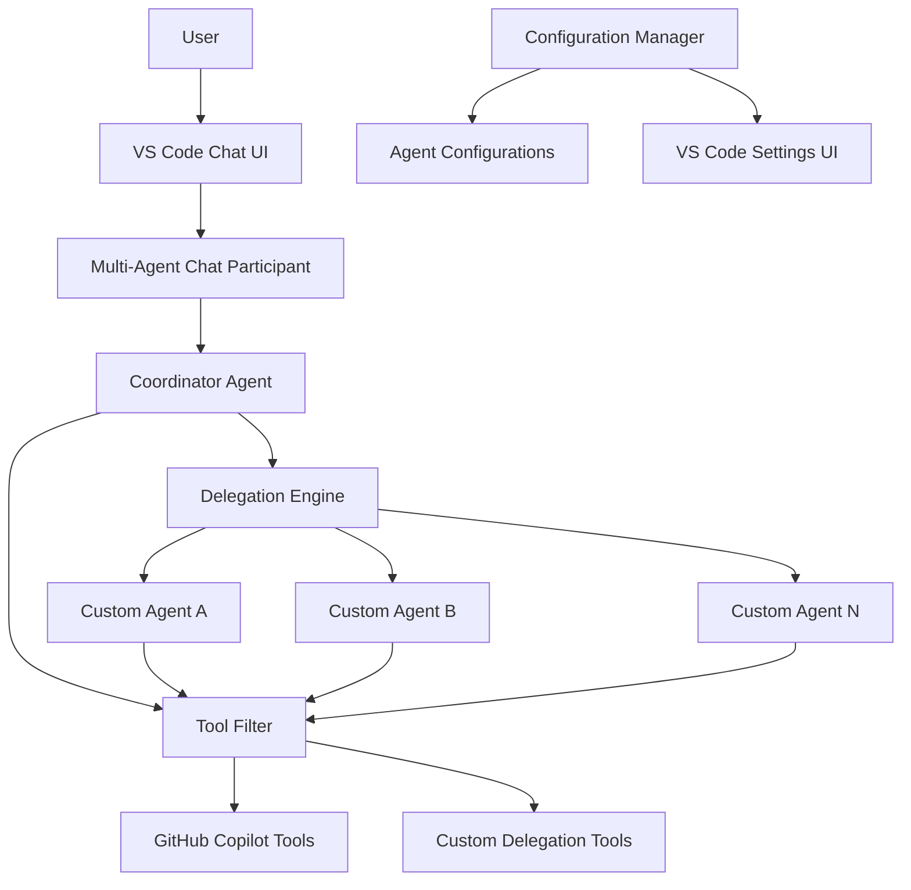

# Design Document

## Overview

The Copilot Multi-Agent extension enhances GitHub Copilot Chat with sophisticated multi-agent capabilities through VS Code's Chat Participant API. The system implements a coordinator-agent pattern where a central coordinator agent orchestrates work delegation to specialized custom agents, each with configurable capabilities, tool access, and delegation permissions.

The extension provides a comprehensive configuration interface for managing agent settings and implements custom tools (`delegateWork` and `reportOut`) to enable seamless inter-agent communication and task coordination.

## Architecture

### High-Level Architecture



### Core Components

1. **Chat Participant**: Main entry point that registers with VS Code's Chat API
2. **Configuration Manager**: Handles agent configuration persistence and validation
3. **Agent Engine**: Manages individual agent instances and their execution contexts
4. **Delegation Engine**: Orchestrates work delegation between agents
5. **Tool Filter**: Controls tool access based on agent permissions
6. **Custom Tools**: Implements `delegateWork` and `reportOut` functionality

## Components and Interfaces

### Chat Participant Interface

```typescript
interface MultiAgentChatParticipant extends vscode.ChatParticipant {
  id: string;
  iconPath?: vscode.Uri;
  requestHandler: (
    request: vscode.ChatRequest,
    context: vscode.ChatContext,
    stream: vscode.ChatResponseStream,
    token: vscode.CancellationToken
  ) => Promise<vscode.ChatResult>;
}
```

### Agent Configuration Interface

```typescript
interface AgentConfiguration {
  name: string;
  systemPrompt: string;
  description: string;
  useFor: string;
  delegationPermissions: DelegationPermissions;
  toolPermissions: ToolPermissions;
}

interface CoordinatorConfiguration extends Omit<AgentConfiguration, 'name'> {
  name: 'coordinator';
}

type DelegationPermissions = 
  | { type: 'all' }
  | { type: 'none' }
  | { type: 'specific'; agents: string[] };

type ToolPermissions = 
  | { type: 'all' }
  | { type: 'none' }
  | { type: 'specific'; tools: string[] };
```

### Delegation Engine Interface

```typescript
interface DelegationEngine {
  delegateWork(
    fromAgent: string,
    toAgent: string,
    workDescription: string,
    reportExpectations: string
  ): Promise<string>;
  
  reportOut(agentName: string, report: string): void;
  
  isValidDelegation(fromAgent: string, toAgent: string): boolean;
}
```

### Tool Filter Interface

```typescript
interface ToolFilter {
  getAvailableTools(agentName: string): vscode.LanguageModelTool[];
  filterTools(
    allTools: vscode.LanguageModelTool[],
    permissions: ToolPermissions
  ): vscode.LanguageModelTool[];
}
```

### System Prompt Builder Interface

```typescript
interface SystemPromptBuilder {
  buildSystemPrompt(
    basePrompt: string,
    agentName: string,
    configuration: ExtensionConfiguration
  ): string;
  
  getDelegationTargets(
    agentName: string,
    configuration: ExtensionConfiguration
  ): DelegationTarget[];
  
  formatDelegationSection(targets: DelegationTarget[]): string;
}
```

## Data Models

### Configuration Storage

The extension uses VS Code's configuration API to store agent settings:

```typescript
interface ExtensionConfiguration {
  coordinator: CoordinatorConfiguration;
  customAgents: AgentConfiguration[];
}
```

Configuration is stored in VS Code settings under the `copilotMultiAgent` namespace:

```json
{
  "copilotMultiAgent.coordinator": {
    "systemPrompt": "You are a coordinator agent...",
    "description": "Coordinates work between specialized agents",
    "useFor": "Task orchestration and delegation",
    "delegationPermissions": { "type": "all" },
    "toolPermissions": { "type": "specific", "tools": ["delegateWork", "reportOut"] }
  },
  "copilotMultiAgent.customAgents": [
    {
      "name": "code-reviewer",
      "systemPrompt": "You are a code review specialist...",
      "description": "Specialized in code review and quality analysis",
      "useFor": "Code review, security analysis, best practices",
      "delegationPermissions": { "type": "none" },
      "toolPermissions": { "type": "specific", "tools": ["reportOut"] }
    }
  ]
}
```

### Agent Execution Context

```typescript
interface AgentExecutionContext {
  agentName: string;
  conversationId: string;
  parentConversationId?: string;
  systemPrompt: string;
  availableTools: vscode.LanguageModelTool[];
  delegationChain: string[];
  availableDelegationTargets: DelegationTarget[];
}

interface DelegationTarget {
  name: string;
  useFor: string;
}
```

### System Prompt Extension

The system automatically extends agent system prompts with delegation information when agents have delegation permissions:

```typescript
interface SystemPromptBuilder {
  buildSystemPrompt(
    basePrompt: string,
    agentName: string,
    delegationTargets: DelegationTarget[]
  ): string;
}
```

Example extended system prompt:
```
[Original system prompt content]

## Available Agents for Delegation

You can delegate work to the following agents using the delegateWork tool:

- **code-reviewer**: Code review, security analysis, best practices
- **documentation-writer**: Technical documentation, API docs, user guides
- **test-engineer**: Unit testing, integration testing, test automation

When using the delegateWork tool, use one of these agent names: code-reviewer, documentation-writer, test-engineer
```

## Error Handling

### Error Types

```typescript
enum MultiAgentErrorType {
  CONFIGURATION_ERROR = 'configuration_error',
  DELEGATION_ERROR = 'delegation_error',
  TOOL_ACCESS_ERROR = 'tool_access_error',
  AGENT_EXECUTION_ERROR = 'agent_execution_error',
  CIRCULAR_DELEGATION = 'circular_delegation'
}

interface MultiAgentError extends Error {
  type: MultiAgentErrorType;
  agentName?: string;
  details?: Record<string, any>;
}
```

### Error Handling Strategy

1. **Configuration Errors**: Validate configurations on load, use defaults for invalid settings, show user warnings
2. **Delegation Errors**: Prevent invalid delegations, provide clear error messages, maintain conversation flow
3. **Tool Access Errors**: Filter tools silently, log access attempts, provide fallback responses
4. **Agent Execution Errors**: Isolate agent failures, provide error context to coordinator, continue with available agents
5. **Circular Delegation**: Detect delegation loops, prevent infinite recursion, provide clear error messages

### Graceful Degradation

- If coordinator fails: Provide direct Copilot Chat fallback
- If custom agent fails: Return error to coordinator, continue operation
- If delegation tools fail: Disable delegation, operate in single-agent mode
- If configuration is invalid: Use default settings, warn user

## Testing Strategy

### Unit Testing

1. **Configuration Manager Tests**
   - Configuration validation
   - Settings persistence and retrieval
   - Default configuration handling
   - Invalid configuration scenarios

2. **Agent Engine Tests**
   - Agent initialization and execution
   - System prompt application
   - Tool filtering and access control
   - Error handling and recovery

3. **Delegation Engine Tests**
   - Work delegation flow
   - Report collection and forwarding
   - Circular delegation detection
   - Permission validation

4. **Tool Filter Tests**
   - Tool permission enforcement
   - Available tool calculation
   - Tool filtering logic
   - Edge cases and invalid permissions

### Integration Testing

1. **Chat Participant Integration**
   - Registration with VS Code Chat API
   - Request handling and response streaming
   - Context preservation across interactions
   - Cancellation token handling

2. **GitHub Copilot Integration**
   - Tool discovery and filtering
   - Language model interaction
   - Response formatting and streaming
   - Error propagation

3. **Configuration UI Integration**
   - Settings UI rendering
   - Configuration validation in UI
   - Real-time configuration updates
   - Settings persistence

### End-to-End Testing

1. **Multi-Agent Workflows**
   - Simple coordinator-to-agent delegation
   - Multi-level delegation chains
   - Concurrent agent execution
   - Error recovery scenarios

2. **User Experience Testing**
   - Configuration setup flow
   - Chat interaction patterns
   - Error message clarity
   - Performance under load

### Test Data and Scenarios

```typescript
const testConfigurations = {
  minimal: {
    coordinator: { /* minimal coordinator config */ },
    customAgents: []
  },
  complex: {
    coordinator: { /* full coordinator config */ },
    customAgents: [
      { /* code reviewer agent */ },
      { /* documentation agent */ },
      { /* testing agent */ }
    ]
  },
  invalid: {
    coordinator: { /* invalid config */ },
    customAgents: [{ /* duplicate names */ }]
  }
};

const testScenarios = [
  'Simple task without delegation',
  'Single-level delegation',
  'Multi-level delegation chain',
  'Circular delegation prevention',
  'Agent failure recovery',
  'Tool access restriction',
  'Configuration update during execution'
];
```

## Implementation Considerations

### Performance

- Lazy load agent configurations
- Cache tool filtering results
- Implement conversation context pooling
- Use streaming responses for better UX
- Optimize delegation chain depth

### Security

- Validate all user inputs in configuration
- Sanitize agent names and descriptions
- Implement tool access controls
- Prevent code injection in system prompts
- Audit delegation chains for security implications

### Extensibility

- Plugin architecture for custom tools
- Agent template system
- Configuration import/export
- API for third-party integrations
- Webhook support for external agent triggers

### Compatibility

- Support VS Code versions 1.105.0+
- Maintain compatibility with GitHub Copilot Chat updates
- Handle API changes gracefully
- Provide migration paths for configuration changes